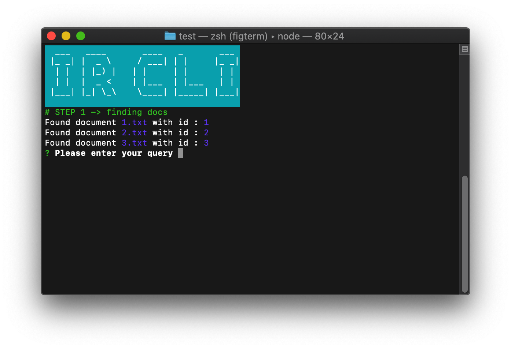

# IR CLI


A Basic tool, for educational purposes.



## Features

1. Posting list indexing via lemmatization and ...
2. Skip list indexing...
3. Positional indexing...
4. Ranking

## Limitations

Currently, only and operation is supported, and positional index supports only one level of and, the other methods can do infinite ands.

## How to install

```bash
npm install -g @steve-moretz/ir-cli
```

## Usage

Run
```bash
ir-cli
```
at a folder containing .txt files, or at an empty folder and let the demo files be generated when you're asked.
Follow the steps from there.

## Testing

```
yarn test
```